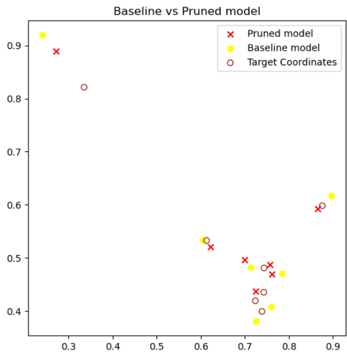

# Pruned and Freezing Weights Model Training

This repository contains a project that implements a robust Equivariant Graph Neural Network model by leveraging **pruning** and **weight freezing** techniques during training. The approach focuses on addressing elements of the training set with high uncertainty while ensuring efficient model performance and comparison against a baseline model.

## Overview

Modern machine learning models often overfit to noise or struggle with data points exhibiting high uncertainty. This project explores a novel training pipeline that integrates:

1. **Pruning:** Removing less significant weights in the network to improve computational efficiency and robustness.
2. **Freezing Weights:** Locking specific weights during training to maintain stability and avoid overfitting to uncertain data points.
3. **Uncertainty-focused Training:** Prioritizing high-uncertainty elements in the dataset to enhance the model's capability to generalize.
4. **Baseline Comparison:** Establishing a clear benchmark by comparing the performance of this robust model with a standard baseline model.

## Features

- Implements a model training routine with pruning and weight freezing techniques.
- Utilizes an uncertainty-based sampling strategy to focus training on challenging data points.
- Compares results with a baseline model to quantify improvements.
- Comprehensive performance evaluation using standard metrics.

## Repository Contents

- `prunedmodel.ipynb`: The main notebook containing the implementation of the pruned and weight-freezing model training process.
- Scripts for loading and preprocessing datasets.
- Visualization tools for uncertainty estimation and model performance.

## Usage

1. Open the `prunedmodel.ipynb` notebook in your preferred Jupyter environment.
2. Follow the step-by-step instructions to load the dataset, preprocess the data, and train the model.
3. Evaluate the model performance and compare it with the baseline.

## Results

- The model demonstrates improved robustness and generalization when focusing on high-uncertainty elements.
- Pruning and weight freezing reduce computational overhead without compromising performance.
- Baseline comparison highlights the advantages of the proposed method.

## Contributing

Contributions are welcome! If you have suggestions or find issues, please open an issue or submit a pull request.

## License

This project is licensed under the MIT License. See the `LICENSE` file for more details.

## Acknowledgments

This work leverages insights from uncertainty-based training methodologies and weight pruning techniques to enhance model robustness. Special thanks to the open-source community for the tools and libraries used in this project.
